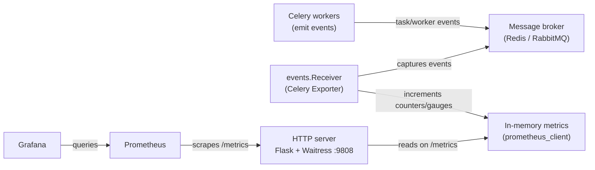

Celery Exporter is a Prometheus exporter that hooks into Celery's native real-time monitoring API to expose task lifecycle events, worker health, and queue metrics — making them available for collection by Prometheus and visualization in Grafana. This page explains what problem it solves, what metrics it exposes, how its HTTP endpoints work, and how its internal architecture fits together.

## Why Celery Exporter?

Celery itself has a built-in event system that workers emit in real time: events for when a task is sent, received, started, succeeded, failed, retried, revoked, or rejected. However, Prometheus cannot consume these events directly — you need a bridge.

Existing open-source bridges had issues: incorrect metric values, missing event types, or stale data from polling. Celery Exporter wraps Celery's `events.Receiver` directly, capturing every event as it happens and maintaining Prometheus counters and gauges in memory. When Prometheus scrapes `/metrics`, it gets an accurate, up-to-date snapshot of exactly what your workers have been doing.

## Key features

- **Real-time event processing** — uses Celery's built-in `events.Receiver` to process task and worker events as they arrive, with no polling delay.
- **Redis and RabbitMQ support** — tested with both brokers, including Redis Sentinel and SSL variants.
- **Queue-length tracking** — reports the number of messages in each broker queue (Redis and RabbitMQ).
- **Worker heartbeat monitoring** — tracks whether each worker is alive based on heartbeat events, with configurable timeouts.
- **Multiple deployment options** — run as a Docker container, a standalone binary (via PyInstaller), or install from PyPI as `prometheus-exporter-celery`.
- **Health check endpoint** — `/health` verifies the broker connection is reachable, suitable for liveness probes.
- **Grafana dashboards** — two pre-built dashboards available on Grafana.com (IDs 17508 and 17509) via the Celery mixin.
- **Prometheus alert rules** — default alerts for task failures and offline workers, provided by the Celery mixin.
- **Configurable metric prefix** — replace the default `celery_` prefix with any custom string.
- **Static labels** — attach arbitrary key-value labels to all metrics, useful for multi-tenant environments.
- **Cardinality controls** — purge metrics for offline workers and use generic hostnames for `task-sent` to keep label cardinality low.

## Metrics reference

Celery Exporter exposes the following metrics. All counters increment monotonically for the lifetime of the exporter process. Task metrics are labeled with `name` (task name), `hostname` (worker host), and `queue_name`. Worker metrics use `hostname`. Queue metrics use `queue_name`.

| Metric | Type | Description |
|--------|------|-------------|
| `celery_task_sent_total` | Counter | Sent when a task message is published. |
| `celery_task_received_total` | Counter | Sent when the worker receives a task. |
| `celery_task_started_total` | Counter | Sent just before the worker executes the task. |
| `celery_task_succeeded_total` | Counter | Sent if the task executed successfully. |
| `celery_task_failed_total` | Counter | Sent if the execution of the task failed. Also labeled with `exception` (exception class name). |
| `celery_task_rejected_total` | Counter | The task was rejected by the worker, possibly to be re-queued or moved to a dead letter queue. |
| `celery_task_revoked_total` | Counter | Sent if the task has been revoked. |
| `celery_task_retried_total` | Counter | Sent if the task failed, but will be retried in the future. |
| `celery_worker_up` | Gauge | Indicates if a worker has recently sent a heartbeat. `1` = alive, `0` = timed out. |
| `celery_worker_tasks_active` | Gauge | The number of tasks the worker is currently processing. |
| `celery_task_runtime_bucket` | Histogram | Histogram of runtime measurements for each task (measured in seconds). |
| `celery_queue_length` | Gauge | The number of messages in the broker queue. |
| `celery_active_consumer_count` | Gauge | The number of active consumers in the broker queue. RabbitMQ and Qpid only. |
| `celery_active_worker_count` | Gauge | The number of active workers subscribed to the broker queue. |
| `celery_active_process_count` | Gauge | The number of active processes in the broker queue. Each worker may have more than one process. |

<Note>
The `celery_` prefix is configurable via `--metric-prefix`. All metric names in the table above use the default prefix.
</Note>

## HTTP endpoints

The exporter runs a lightweight [Flask](https://flask.palletsprojects.com/) application served by [Waitress](https://docs.pylonsproject.org/projects/waitress/) on port `9808` by default.

| Endpoint | Method | Description |
|----------|--------|-------------|
| `/` | GET | HTML index page with a link to `/metrics`. |
| `/metrics` | GET | Prometheus metrics in text or OpenMetrics format. Triggers a queue-length scrape on every request. |
| `/health` | GET | Broker connectivity check. Returns `200` with a message if connected, `500` if the broker is unreachable. |

The `/health` endpoint attempts up to three retries when connecting to the broker, making it suitable for Kubernetes liveness and readiness probes.

## Architecture overview

When the exporter starts, it:

1. Connects to the broker using the URL supplied via `--broker-url`.
2. Starts the Flask/Waitress HTTP server in a background daemon thread.
3. Enters an infinite loop running `events.Receiver.capture()`, which subscribes to Celery's event fanout and calls the appropriate handler for each event type.
4. On each `/metrics` request, triggers `scrape()` to refresh queue-length gauges and check for timed-out workers before returning the metric output.

Task event handlers (`track_task_event`) update the relevant counter and, for `task-succeeded`, record runtime in the histogram. Worker heartbeat handlers (`track_worker_heartbeat`) update `celery_worker_up` and `celery_worker_tasks_active`. The worker timeout logic marks workers as offline if no heartbeat is received within the configured window (default: 5 minutes), and optionally purges their metrics after a longer window (default: 10 minutes).

## Next steps

<CardGroup cols={2}>
  <Card title="Quickstart" icon="rocket" href="/quickstart">
    Get Celery Exporter running in minutes with a step-by-step guide.
  </Card>
  <Card title="Deployment" icon="server" href="/deployment/docker">
    Deploy with Docker, Kubernetes Helm chart, or standalone binary.
  </Card>
  <Card title="Configuration reference" icon="sliders" href="/configuration/cli-options">
    Browse all CLI flags, environment variables, and broker transport options.
  </Card>
  <Card title="Metrics reference" icon="chart-bar" href="/monitoring/metrics-reference">
    Explore every metric, its labels, and example PromQL queries.
  </Card>
</CardGroup>
